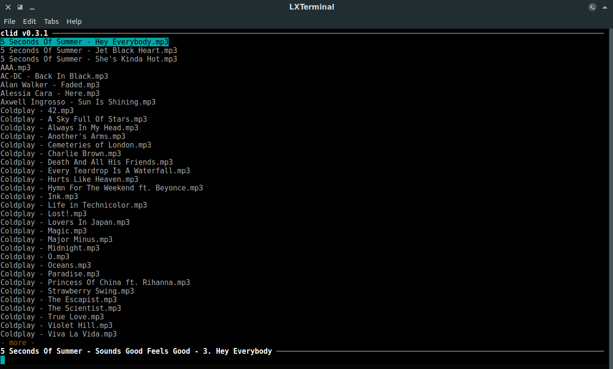
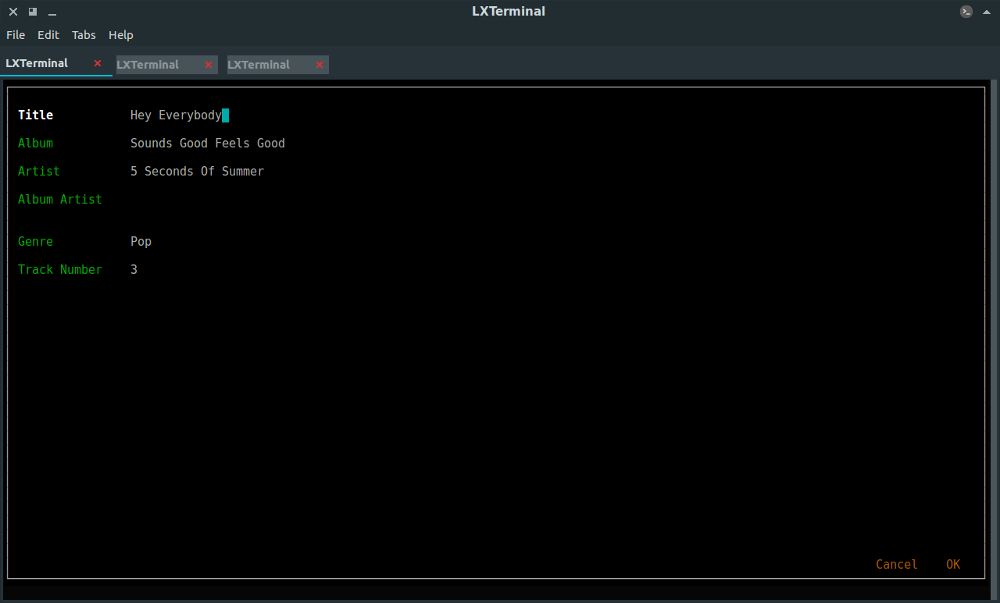

# clid

Clid is a command line app written in Python3 for command-line lovers to edit mp3 files' ID3 tags. This app is different from other
command line tools to edit tags, as you can edit tags in a graphical interface.(It's like [cmus](https://github.com/cmus/cmus),
without the player and with a tag editor)

Made with a lot of help from

- [npyscreen](https://bitbucket.org/npcole/npyscreen), a Python wrapper around ncurses.
- [stagger](https://github.com/lorentey/stagger), an ID3v1/ID3v2 tag manipulation package written in pure Python 3
- [configobj](https://github.com/DiffSK/configobj), a Python 3+ compatible port of the configobj library
- and a laptop with 512 MB RAM(Yeah. I know.)

## Changelog

### v0.6.3

- [x] Vi keybindings
- [x] Added option for smooth scroll
- [x] Preferences are now saved when updating the app
- [x] Validators for `smooth_scroll` and `preview_format`
- [x] Display a "What's New" Popup when app is run after an update

### v0.6.2

- [x] Fix: Issue #1 in Github
- [x] Added key-binding(`u`) for reloading `music_dir`
- [x] Fix: All option are now aligned properly in preferences view
- [x] Added validators for preferences(Error message is shown if an error occurs)


## Installation

> Note: You should have Python 3 installed, not Python 2, to install and use clid.

> Note: You will have to install pip manually if the Python version is < 3.4


### Using pip

```shell
$ [sudo] pip install clid
```

### From Source

```shell
$ git clone https://github.com/GokulSoumya/clid.git
$ cd clid
$ [sudo] python3 setup.py install
```

You can then launch the app by entering `clid` in the command line.


## Usage

### Viewing Files

The main window will show the mp3 files you have in `~/Music`. The interface is similar to that of cmus:



You will have a command line at the bottom of the window, to recieve commands. You will also see a live preview of the
common tags of the file under the cursor.

> Note: The status line shows the tags in `artist - album - track_number title` format by default; you can change it in preferences

### Editing Tags

To edit the tags of a file, simply hit <kbd>Enter</kbd>(or <kbd>Return</kbd>). You will see a new window:



Use the arrow keys to move through the tags; edit them if needed and hit `OK`(or <kbd>Ctrl</kbd> + <kbd>S</kbd>) when you're done. `Cancel`(<kbd>Ctrl</kbd> + <kbd>Q</kbd>) will discard changes.


### Editing Preferences

To edit preferences, press `2`. Then hit <kbd>Enter</kbd> on the highlighted setting to edit it (it will be then shown
at the bottom of the screen; edit it and hit <kbd>Enter</kbd> again).

 

| Option | Description | Default Value|
|--------|-------|---------|
| `music_dir` | Directory in which the app will search for mp3 files | `~/Music` |
| `preview_format` | Format in which a preview of the file under cursor will be shown | `%a - %l - %n. %t` |
| `smooth_scroll` | Enable or disable smooth scroll | `true` |
| `vim_mode` | Enable or disable Vim keybindings when editing metadata | `false` |

#### Supported Format Specifiers

| Format Specifier | Expands to... |
|:----------------:|:-------------:|
| %t | Title |
| %a | Artist |
| %l | Album |
| %n | Track Number |
| %c | Comment |
| %A | Album Artist |
| %y | Date |
