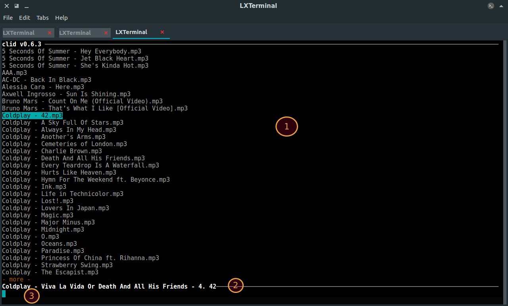
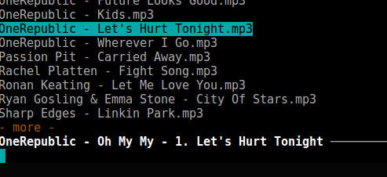
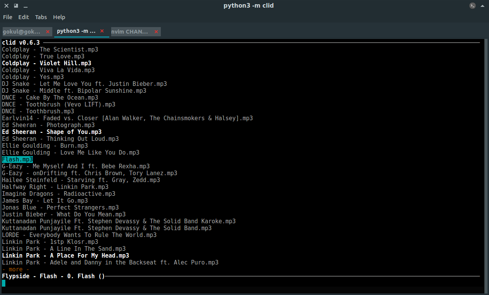
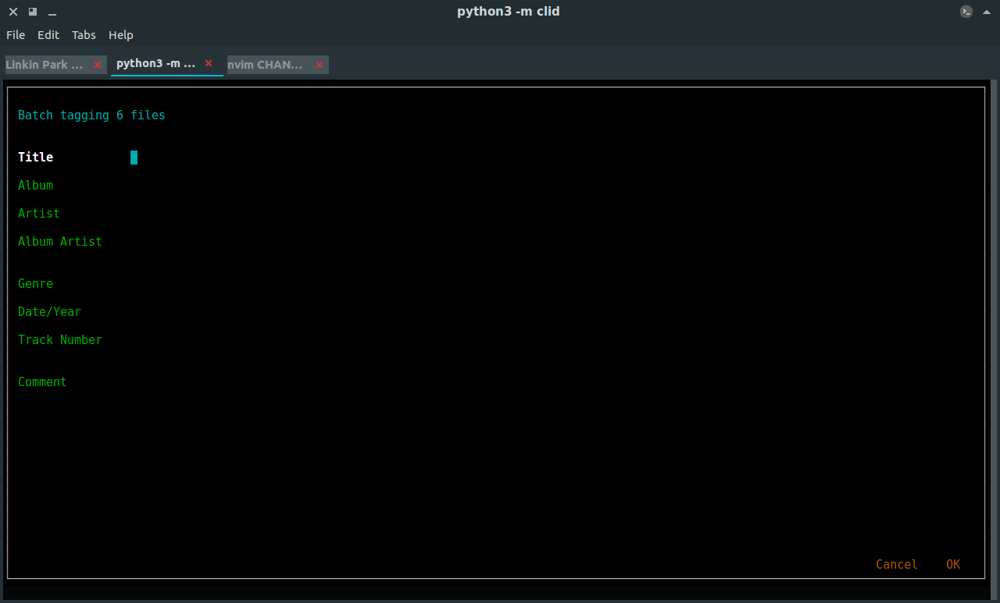

# clid

Clid is an app for editing metadata(tags) of mp3 files without leaving the coziness of the terminal ;)
Clid differs from other command line tools to edit tags, as it provides a curses based ui.

## Installation

You're gonna need two things before you install the app:
- Python**3**
- Pip(python's package manager)[optional]

Pip will be installed by default if Python version is > 3.4 (`python --version`).
Else you will have to install it manually.
<!--instructions on how to do this-->

You can use your package manager to install them.

### Using Pip

```shell
$ [sudo] pip install clid
```

### From Source(Without Pip)

```shell
$ git clone https://github.com/GokulSoumya/clid.git
$ cd clid
$ [sudo] python3 setup.py install
```

### Updating

To update the app, run

```shell
$ [sudo] pip install -U clid
```

## Launching The App

Type `clid` in the command line to start the app(and `:q` in the main window to quit):


## Quick Start

1. Move with arrow keys or `j` and `k`.
2. <kbd>Enter</kbd> to select a file.
3. Edit the tags.
4. `OK` to save the tags or `Cancel` to abort edit.
5. Type `:q` at main window to quit.

## Main Window

Main window has 3 parts:



1. [File viewer](#file-viewer), showing files in `~/Music` by default,
2. [Status line](#status-line), showing live preview of tags of file under cursor,
3. [Command line](#command-line), which accepts commands.

### File Viewer

You can see the mp3 files in the [selected directory](#list-of-available-options) in the main window.
Files are read every time the app is started. You can use <kbd>UpArrow</kbd>, <kbd>DownArrow</kbd>,
<kbd>j</kbd>, <kbd>k</kbd>, <kbd>Home</kbd>, <kbd>PageUp</kbd>, etc to move around. Hit <kbd>Enter</kbd>
when you've found the file you want to edit, or [batch tag files](#tagging-multiple-files-at-once).
You can also [search for files](#searching-for-files).

#### Searching For Files

You can search for files by pressing <kbd>/</kbd>. Note that this is only a basic search - it doesn't search the tags
of every file, only the filename is checked.

1. Press <kbd>/</kbd>.
2. Enter the search term. Results are shown as you type.
3. Press <kbd>Enter</kbd> to terminate search and navigate search results.
4. Press <kbd>Esc</kbd> to return to normal view.

Your selections for batch tagginf(if any) are kept intact when searching.
[See a note](#esc-key) on the <kbd>Esc</kbd> key.

> To use regular expressions in your search; set the `use_regex_in_search` option to `true`

### Status Line



The status line shows a live preview of metadata of file under cursor in the
[specified format](#customizing-tag-preview-format). The default format is
`artist - album - track_number title`.

### Command Line

You can execute commands and perform searches from here. Press `:` to enter [commands](#available-commands)
and `/` to [search for files](#searching-for-files).

## Editing Tags

### Tagging Individual Files

1. Select the file you want to edit with <kbd>Enter</kbd>
2. Edit the tags as required.

> You can also change the name of the file here. The extension(`.mp3`) isn't shown.

3. You can then press `OK` to save the changes or `Cancel` to discard changes. Default keybindings for
saving tags is <kbd>Ctrl</kbd> + <kbd>S</kbd> and canceling is <kbd>Ctrl</kbd> + <kbd>Q</kbd>.

### Tagging Multiple Files At Once

You can batch tag files in clid:

1. Select and deselect files with <kbd>Space</kbd> and press <kbd>Enter</kbd> to edit the files. *Note that
pressing <kbd>Enter</kbd> will also add the file currently under the cursor to list of files that will be edited*. You can also search for files and then add them to the list of files to be edited.

> Note: Press <kbd>Esc</kbd> to discard selections. [See a note](#esc-key) on the <kbd>Esc</kbd> key.



2. You will see a window with blank tag fields. Only the tag fields which you modify here will be saved to the
files, that is, if this is what you have,



then since Album and Artist are the only fields with text, only those will be written to the selected mp3 files.

3. You can save or cancel as mentioned above.

> You can invert your selection by using the <kbd>i</kbd> keybinding.

> If no previous selection has been made, you can use <kbd>i</kbd> to select every file

## Editing Preferences

> Config file is located at `~/.config/clid/clid.ini`.

You can edit preferences by pressing <kbd>2</kbd>.

1. Select the option you want to edit and press <kbd>Enter</kbd>.
2. There will be a prompt in the command line; edit the option and press <kbd>Enter</kbd>.
3. If you gave an invalid value, an error message will be shown.

### List Of Available Options

| Option | Description | Default Value | Acceptable Values |
|:--------:|-------|:---------:|----------|
| `music_dir` | Directory in which the app will search for mp3 files recursively | `~/Music` | Any valid path |
| `preview_format` | Format in which a preview of the file under cursor will be shown | `%a - %l - %n. %t` | See [list of valid format specifiers](#customizing-tag-preview-format) |
| `smooth_scroll` | Enable or disable smooth scroll | `true` | `true` / `false` |
| `vim_mode` | Enable or disable Vim style keybindings | `false` | `true` / `false` |
| `use_regex_in_search` | Enable or disable regular expressions when searching | `false` | `true` / `false` |

#### Vim Mode

Vim style keybindings can be enabled, which currently supports basic stuff like adding, inserting and deleting text.
[See a note](#esc-key) on the <kbd>Esc</kbd> key.

#### Customizing Tag Preview Format

The preview format can be edited using format specifiers:

| Format Specifier | Expands to... |
|:----------------:|:-------------:|
| %t | Title |
| %a | Artist |
| %l | Album |
| %n | Track Number |
| %c | Comment |
| %A | Album Artist |
| %y | Date |

Example: `%a - %l [%n] %t (%y)` expands to `Artist - Album [Track Number] Title (Date)`

## Default Keybindings

| Action | Key | Context |
|:------|:---:|:-------|
| Move Up | `k`, `UpArrow` | Preferences / Main View |
| Move Down | 'j', `DownArrow` | Preferences / Main View |
| Select file for editing / select option to be edited | `Enter`, `x` | Preferences / Main View |
| Switch to Main View | `1` | Preferences |
| Select files | `Space` | Main View |
| Switch to Preferences | `2` | Main View |
| Reload mp3 files in current directory | `u` | Main View |
| Discard selection | `Esc` | Main View(after selecting for batch tagging) |
| Discard search results and show all files | `Esc` | Main View(after searching) |
| Save changes | `Ctrl + S` | Meta Editing Window |
| Discard changes | `Ctrl + W` | Meta Editing Window |
| Invert Selection | `i` | Main View |
| Quit | `Ctrl + Q` | Main View |

## Available Commands

Press `:` to start entering commands

`set <option name>=<value>`
    Set the option(from preferences) to value

`q`
    Quit the app

## Miscellaneous

### Esc Key

The `Esc` key is a bit sluggish. It seems to be a problem with one of the dependencies.
When `vim_mode` is enabled, pressing `Esc` after editing text to enter Normal mode
will take some time(just a bit).

Discarding search results and selection are both bound to the `Esc`. When `Esc` is pressed
in Main View, clid first checks if there are any search results being displayed. If there are
any, that is cleared *first* and no further actions are taken. If there are no search results,
*then* file selections are discarded. This ensures that you can search for files, add them
to file selection list, and return to Main View with the selection list intact.

### What's New

When clid is updated a "What's New" window is shown. Contents of `~/.config/clid/NEW` are
shown in it.
